# Sequent — State Machine Catalog

**Date:** 2026-07-06 · **Branch:** `claude/ultracode-effort-fgbwt6` · **Scope:** every stateful entity in the web app with 2+ meaningfully distinct states and real transition logic — global stores, view-local UI state, and the shared kit's interaction primitives. Booleans that gate no divergent behavior (most `settingsStore` toggles) are omitted; they're settings, not state machines.

**Method:** direct read of every store and the components that mutate it, cross-referenced against every call site of each transition function. One real bug was found and fixed in the process — see [§3](#3-modal-state-uistorestateactivemodal).

---

## 1. View state (`uiStore.state.view`)

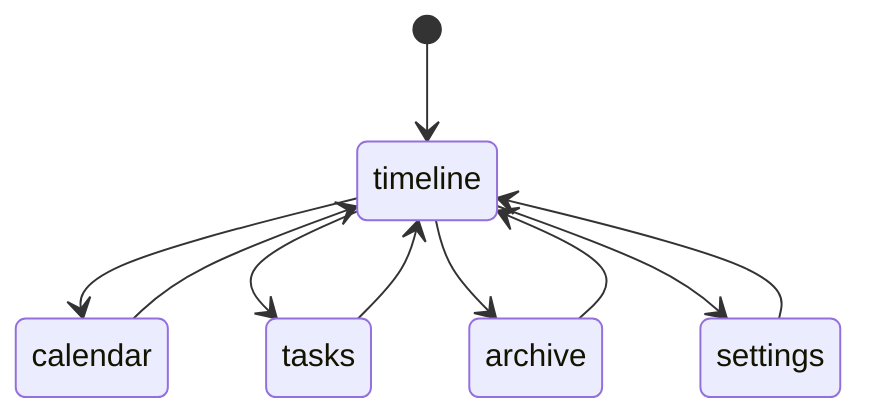

**States:** `timeline` (default) · `calendar` · `tasks` · `archive` · `settings`
**Transition:** `uiStore.setView(view)`, fired from any `SideNavItem` click.
**Shape:** complete graph — every view reaches every other view directly in one step; `timeline` is drawn as a hub only for legibility, not because it's a required stop.

**Debt found:** `setView` also computes `viewDirection` (`'up'`/`'down'`) from each view's index in a fixed order, to drive a directional slide animation. That animation was retired in Phase 3 (`App.jsx` now does a plain `<Switch>`). The field is still computed and stored on every transition; nothing reads it. Harmless, but it's a state machine output with zero remaining consumers — safe to delete next time this file is touched.

---

## 2. Onboarding gate (`uiStore.state.hasSeenOnboarding`) + step wizard

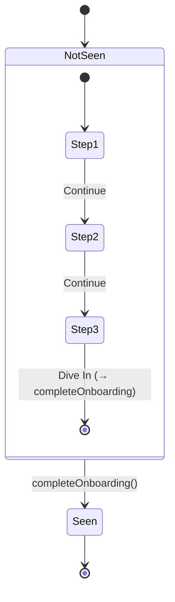

**Outer gate:** `NotSeen` (default, unless `localStorage.sequent_onboarding_seen === 'true'`) → `Seen`, one-way, persisted, terminal.
**Inner wizard** (`OnboardingModal`'s local `step` signal, only reachable while `NotSeen`): 3 fixed steps, forward-only — no back button. The last step's "Dive In" both advances past step 3 and fires `completeOnboarding()` in the same click, collapsing the inner and outer machines into one action.

---

## 3. Modal state (`uiStore.state.activeModal`)

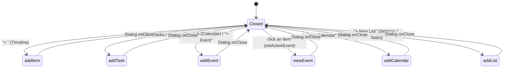

**States:** `Closed` (`null`, default) plus 6 named modals. Every open state closes the same way — the kit `Dialog`'s `onClose` (Escape, backdrop click, close button, or a successful form submit) always resolves to `uiStore.setActiveModal(null)`.

**Invariant:** exactly one function is allowed to write `'viewEvent'`: `uiStore.setActiveEvent(id, type)`, which sets `activeEventId`, `activeEventType`, *and* `activeModal` together, atomically, so the three fields can never disagree.

> #### 🔴 Bug found and fixed by this exercise
> `TimelineView.jsx`'s `openItem(item)` — the handler behind the all-day chip, an overlapping-items group, and the today-pane agenda row — called `uiStore.setActiveEvent(id, 'event')` (correctly setting `activeModal → 'viewEvent'`) and then **immediately overwrote it** with `uiStore.setActiveModal('eventView')`, a second, differently-spelled string that `EventViewModal` never checks for. Net effect: clicking an event through any of those three paths silently did nothing — no error, no modal, no test failure, because nothing exercised that click path. Fixed by deleting the redundant, mismatched call; `setActiveEvent`'s own write is authoritative. Regression test: `src/components/timeline/TimelineView.test.jsx`.
>
> This is the textbook failure mode FSM modeling exists to catch: a second writer to the same field, using a value the reader's guard doesn't recognize. The invariant above ("exactly one function writes `viewEvent`") is what the bug violated, and stating it explicitly is what surfaced it.

---

## 4. Overlay ownership stack (`kit/overlayStack.js`)

Not a plain FSM — a **stack** (pushdown automaton). Depth, not a fixed label set, is the state, and only the top of the stack ever reacts to `Escape`.

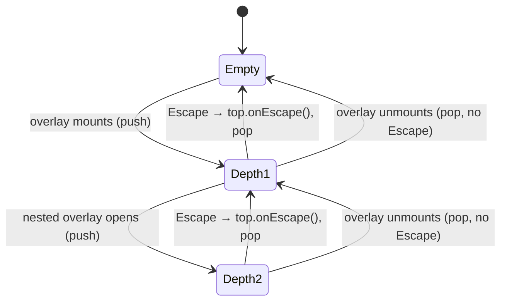

**Invariant:** the stack's *push order* — not the *mount order of each overlay's container* — determines who owns `Escape`. Every `Dialog`, `Popover`, and (via `EscapeLayer`) `Selector`/`DatePicker`/`TimePicker`/`ColorPicker` registers a frame on mount/open and deregisters on unmount/close; exactly one `document` `keydown` listener exists at a time, installed lazily on the first push and torn down when the stack empties.

**Historical bug (found and fixed in code review, before this exercise):** the original implementation had each overlay register its *own* independent `document` listener, gated by `if (e.defaultPrevented) return`. That guard implicitly assumed the nested overlay's listener would run *first* — but same-target listeners fire in *registration* order, and a `Dialog` is always registered before anything opened later inside it, so the outer `Dialog` always ran first, closed itself, and marked the event handled before the real topmost overlay ever got a say. The shared stack in §4 is the fix: ownership is derived from actual push order, which is the only thing that correctly tracks nesting regardless of when each container happened to mount.

---

## 5. Generic overlay lifecycle (Dialog / Popover / Selector / pickers)

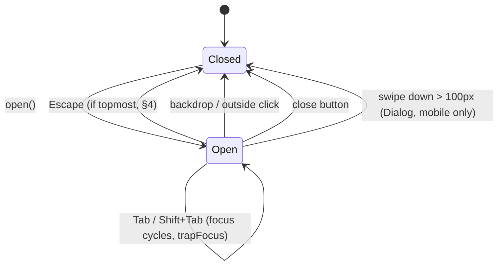

Every overlay in the kit now shares this exact shape via `overlayStack.js`'s `useOverlayLayer`/`EscapeLayer`, `trapFocus`, and `useOutsideDismiss` — before the Phase 2/review-fix work each one (`Dialog.jsx`, `Popover.jsx`, `Selector.jsx`, and three hand-rolled pickers) had its own slightly different version of this machine. Convergence here is a large part of why the overlay-stack fix in §4 was a single change instead of six.

---

## 6. Auth gate (`authStore` + `AuthGuard`)

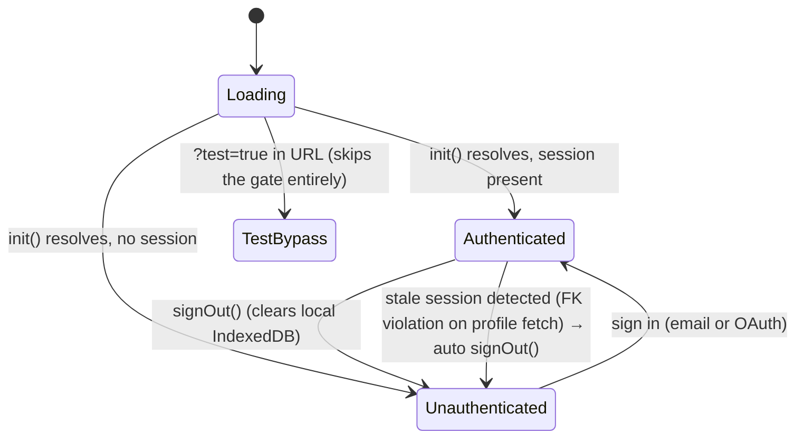

**Default:** `Loading` (`authStore.state.loading = true`), rendered as the kit `Spinner`. `TestBypass` is a parallel path around the normal gate (`AuthGuard` renders children when `window.location.search.includes('test=true')`, regardless of session) — used by the e2e suite and this session's screenshot script; it does not touch `authStore` at all, so it's a rendering-level bypass, not a real authenticated state.

---

## 7. Toast lifecycle (per-instance, `toastStore`)

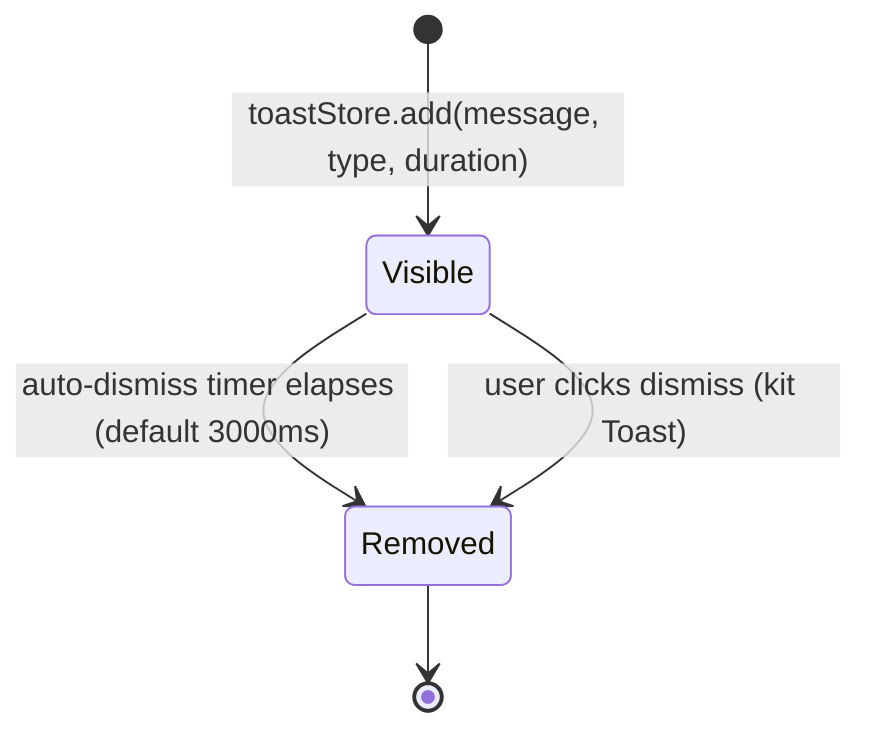

Each toast is its own instance of this two-state machine; `toastStore.state.toasts` is just the list of currently-`Visible` instances. `remove(id)` is idempotent (array filter), so a manual dismiss doesn't cancel the pending `setTimeout` — it just fires harmlessly into a no-op later. Not a bug, but worth knowing before "fixing" it as one.

---

## 8. Pomodoro timer (`PomodoroWidget`)

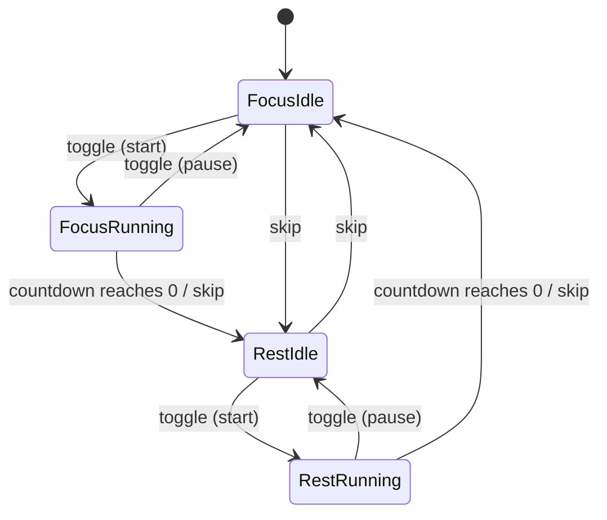

Two orthogonal facts (`mode: 'focus'|'rest'` × `isRunning: bool`) collapse cleanly into 4 named states. `toggle` always flips only `isRunning`, staying in the same mode; `skipMode`/countdown-completion always flips `mode` and resets to that mode's `Idle`. No state lets both happen in the same transition — a nice property this widget gets by construction, not by an explicit guard.

---

## 9. Calendar view segment (`CalendarView`)

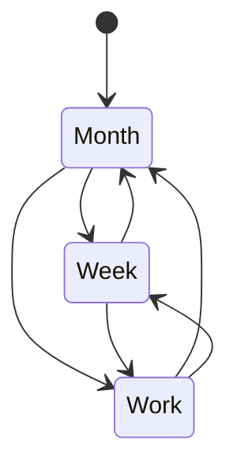

**Backing state:** `viewMode` (`'month'`\|`'week'`, local signal) × `settingsStore.state.workWeekOnly` (persisted). `Week` = `viewMode:'week'` + `workWeekOnly:false`; `Work` = `viewMode:'week'` + `workWeekOnly:true`. All 3 are directly reachable from each other via the `SegmentedControl`; `handleViewSegmentChange` no-ops if the target segment is already active.

**Two historical bugs lived at exactly this transition, both already fixed:** (1) `settingsStore.setWorkWeekOnly` didn't exist at all on `main` — every `Week`/`Work` toggle threw a `TypeError` in production (fixed in Phase 5, before this exercise); (2) `CalendarView` additionally kept its own local `workWeekOnly` signal, written in parallel with the store on every toggle — two sources of truth for one field (fixed in the code review pass). Both bugs are different failure modes of the same underlying fact: this transition writes a piece of state that something *else* also reads, and for a while nothing enforced they agreed.

---

## 10. Timeline local UI toggles (`TimelineView`)

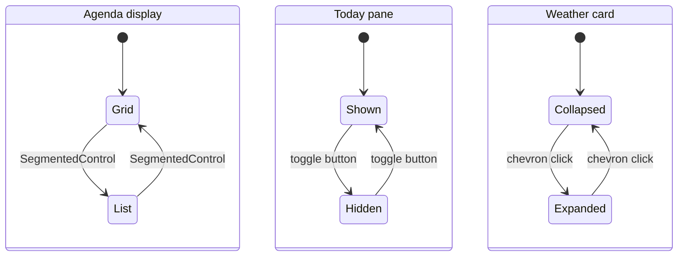

Three independent 2-state toggles (`scheduleViewMode`, `showTodayPane`, `isWeatherExpanded`) with no coupling between them — shown as parallel regions because that's exactly what they are: three orthogonal facts about one view, not one combined state space.

---

## 11. Kit optimistic-action pattern (`CheckboxInput` / `Switch` / `Selector`)

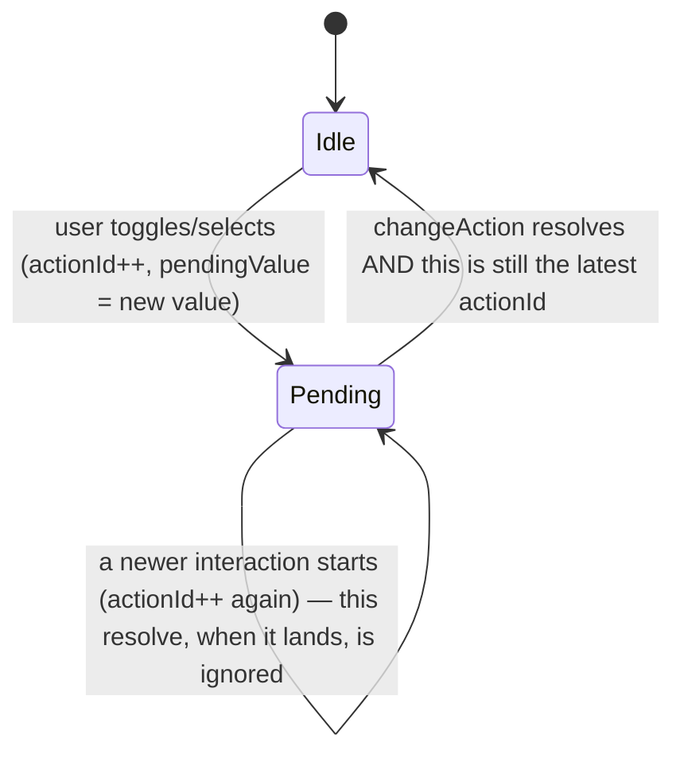

Displayed value is `pendingValue ?? local.value` — the control shows the optimistic value immediately, before `changeAction` (often a network/store round-trip) settles. The `actionId` monotonic counter is a stale-settle guard: if the user toggles again before the first `changeAction` resolves, the first resolution's cleanup checks `thisAction === actionId` and does nothing if it's no longer current, so a slow first request can never clobber a fresher pending value with stale data. This is the same class of correctness technique as §4's stack — *order of completion is not the same as order of relevance; track the latter explicitly.*

---

## Where the FSM lens earned its keep

Three real, already-shipped bugs in this codebase trace to the same root cause — **a second writer disagreeing with the first reader's guard** — surfaced by writing these machines down explicitly rather than by reading the code procedurally:

1. §3 — `openItem()` wrote `'eventView'`, `EventViewModal` read for `'viewEvent'`. *(found and fixed by this exercise)*
2. §4 — Escape ownership was assumed from listener-registration order instead of push/stack order. *(found and fixed in code review)*
3. §9 — a local `workWeekOnly` signal shadowed the persisted store field it was meant to mirror. *(found and fixed in code review)*

None of these threw a build error, an ESLint warning, or a failing test — each one is only visible as *"the state this transition claims to reach doesn't match the state the consumer is guarding for."* That's precisely the question an explicit state-machine catalog forces you to ask per transition, and procedural code-reading doesn't.
